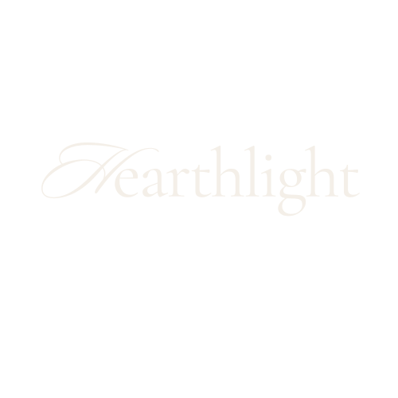
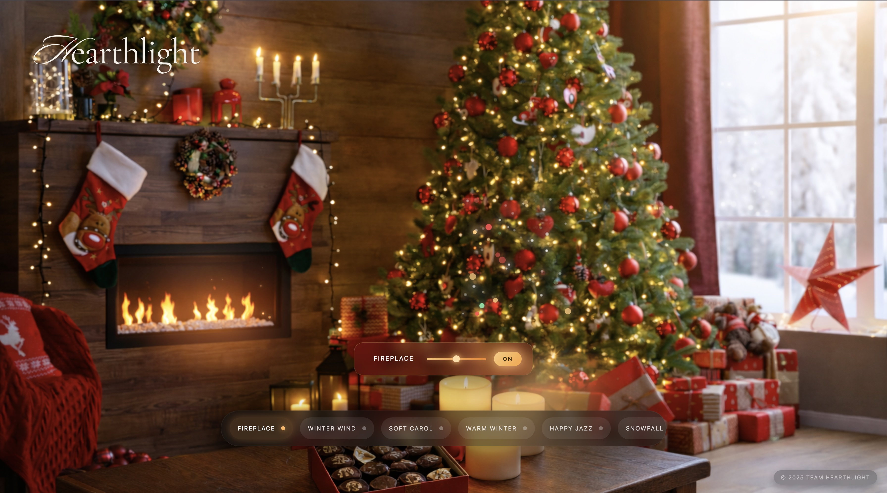
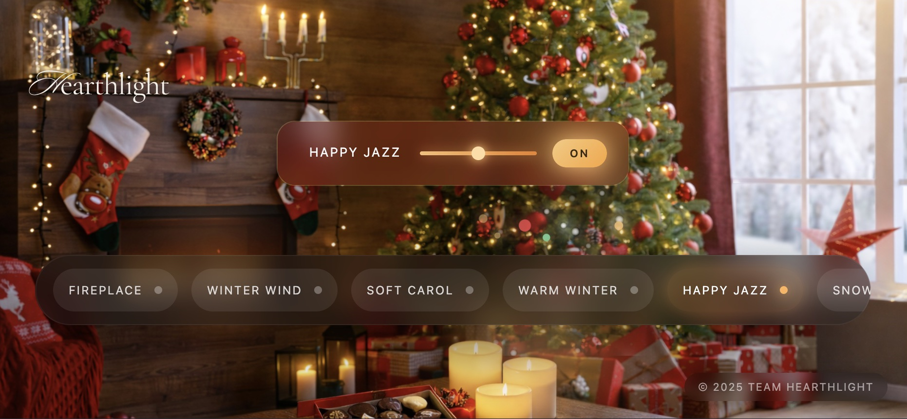
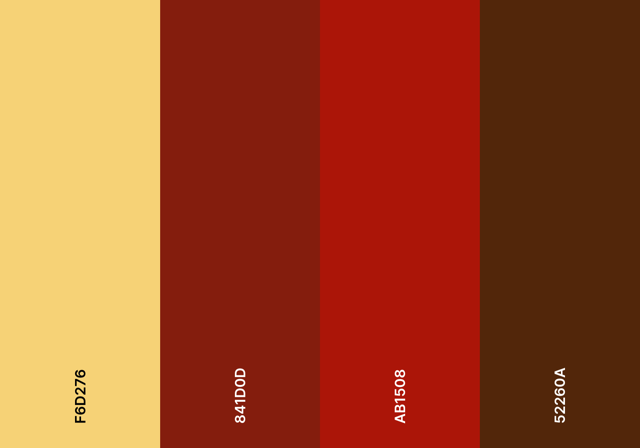

# Hearthlight 

> *A cinematic, interactive festive winter ambience experience.*
<p align="center">
  
</p>
🔗 **Deployed Project:** [https://fatimascoding2020.github.io/Hearthlight/]

---

## Overview

**Hearthlight** is a web-based ambient experience designed to evoke warmth, calm, and comfort through a cinematic festive living-room scene. The project blends layered visual effects with looping ambient soundscapes, allowing users to create a personalized, cozy atmosphere.

Hearthlight focuses on **mood, polish, and immersion**, using animation and sound to create an emotionally engaging digital space.

---

## User Stories

### Core Experience

* **As a user**, I want to instantly see a cozy, festive scene when the page loads so that I feel immersed without needing instructions.
* **As a user**, I want smooth, cinematic animations so that the experience feels calming and high quality.
* **As a user**, I want the fireplace visuals to feel alive with subtle movement so that the environment feels warm and realistic.

### Audio Interaction

* **As a user**, I want to select an ambient sound with a single click so that I can quickly set the mood.
* **As a user**, I want only one ambient sound to play at a time so that the soundscape remains peaceful and uncluttered.
* **As a user**, I want audio transitions to fade smoothly so that switching sounds feels natural and non-jarring.
* **As a user**, I want to control the volume of the active sound so that I can adjust it to my comfort level.
* **As a user**, I want to upload my own ambient audio so that I can personalize the experience.

### Interface & Feedback

* **As a user**, I want to see which sound is currently playing so that I always understand the current state.
* **As a user**, I want the active sound card to remain a consistent size so that the interface feels stable and polished.
* **As a user**, I want long audio names to scroll smoothly instead of being cut off so that I can read the full title.

### Responsiveness & Stability

* **As a user on mobile**, I want the layout to adapt to my screen orientation so that the experience remains visually correct in both portrait and landscape.
* **As a user**, I want unnecessary effects to be reduced on small devices so that performance remains smooth.
* **As a user**, I want animations and audio to load cleanly without visual glitches or flashing.

---

## Features

### Cinematic Visual Effects

* Fireplace glow with subtle GSAP-driven motion
* Heat shimmer distortion above the fire
* Animated ember particles rising from the fireplace
* Candle glow with flicker animation
* Christmas tree fairy lights with gentle pulsing
* Layered snowfall effect
* Smooth logo entrance animation

All visual motion is driven using **GSAP timelines** for smooth, performant animation.

---

### Ambient Sound System

* Curated looping ambient tracks (fireplace, winter wind, jazz, holiday music)
* Seamless fade-in and fade-out between sounds
* One active sound at a time for a calm soundscape
* Persistent active sound popup with:

  * Volume slider
  * On/Off toggle
  * Animated scrolling (marquee) sound title
* Support for **user-uploaded audio files** with size and duration validation

---

### Responsive Design

* Desktop-first cinematic composition
* Mobile-safe layout adjustments
* Portrait and landscape mobile handling
* Reduced or repositioned effects on mobile to prevent layout drift
* Fixed positioning for critical UI elements (logo, sound deck, active sound popup)

---

### Polished UI/UX

* Floating sound selection deck with auto-hide behavior
* Drag-to-scroll sound deck on desktop
* Touch-friendly interactions on mobile
* Stable active sound card sizing regardless of audio name length
* Smooth transitions and hover states
* Minimal UI to maintain visual focus on the scene

---

## Technology Stack

### Core

* **HTML5**
* **CSS3**
* **Vanilla JavaScript**

### Animation

* **GSAP (GreenSock Animation Platform)**
  Used for all visual animations, timelines, and transitions.

### Audio

* **HTML5 Audio API**
* GSAP-powered volume tweening for cinematic fades

---

## Project Structure

```
hearthlight/
├── assets/
│   ├── images/          # Background and scene images
│   ├── audio/           # Ambient sound files
│   └── logo/            # Logo assets
├── styles.css           # Global styles and responsive rules
├── main.js              # Animation logic and audio system
├── index.html           # Application entry point
└── README.md            # Project documentation
```

---

## Wireframes

### Desktop View


### Mobile – Portrait
<p align="center">
  
</p>

### Mobile – Landscape



---

## Color Palette




Hearthlight visual theme:

* Warm Gold
* Ember Orange
* Candle Ivory
* Evergreen
* Deep Wood Brown
* Soft Charcoal


---

## Performance Considerations

* GSAP ensures smooth 60fps animations
* Particle effects are lightweight and auto-cleaned
* Audio objects are reused to reduce memory usage
* Mobile-specific adjustments reduce GPU strain

---

## Browser Compatibility

Tested on modern browsers supporting:

* ES6+
* CSS Flexbox
* HTML5 Audio

Verified on:

* Chrome (desktop & mobile)
* Safari (desktop & mobile)

---

## Contributors

* **Syeda Fatima Omer- https://github.com/FatimasCoding2020** and **Freddie- https://github.com/Shieldsx** Design, Animation, Audio System, UI/UX


---

## License

This project was created for educational and demonstration purposes.
All third-party assets remain the property of their respective owners.

---

